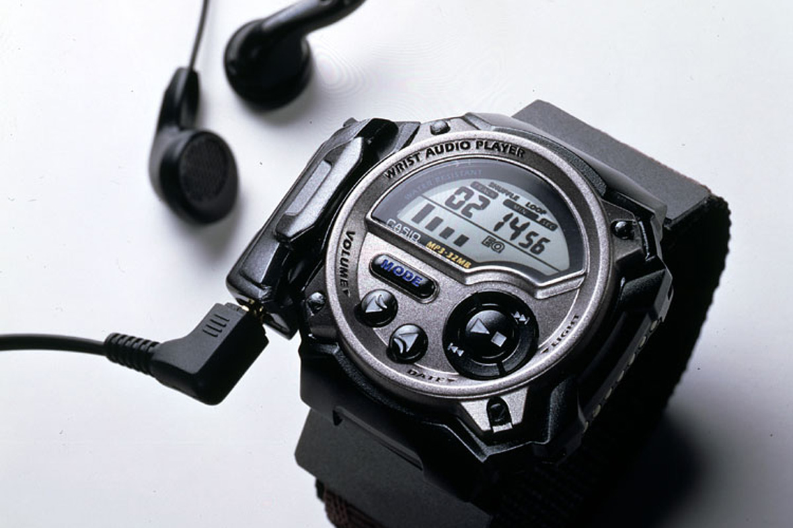

casio-wmp1
==========
*Software for file management on the classic Casio WMP-1 watch*

This source code _should_ enable you to use the classic Casio WMP-1 wrist watch
on all modern platforms, as its only dependency is libusb. 
Unfortunately it only works successfully in Linux at the moment:
- [Unable to compile libusb32](https://github.com/fatso83/casio-wmp1/issues/2) on Windows. 
- libusb has a bug in OS X [that aborts transfers](https://github.com/fatso83/casio-wmp1/issues/1)

For a bit of history and usage, see the old <a
href="original_documentation/README">README</a>

## Additional info
I have kept an old copy of the original software for Windows 98 <a
href="https://dl.dropboxusercontent.com/u/514315/binaries/casio_wmp1/casio_wap.zip">Casio WAP.</a> Still worked in Windows XP the last time I tried it (using Win98 emulation mode). Do not know about Windows 7 though ... But if you are on the lookout, then this is your lucky day :)

I also have a copy of the original contents of the MMC (including firmware) in
case you should somehow manage to fuck it up. Can be found <a
href="https://dl.dropboxusercontent.com/u/514315/binaries/casio_wmp1/wmp1_org_firmware.dat">here</a>.

## Main contributors
- Florian Schmidt (development)
- Carl-Erik (minor bug fixes, research, documentation and code archeology)
- Martin Kiewitz (wrote the original REXX code for OS/2)

## Changelog:

### June 14 2018 Added original REXX code
Thought it would be fun to find and add the original code for OS/2 that I sent Florian originally.
I found it on the [OS/2 archive "Hobbes"](http://hobbes.nmsu.edu/h-viewer.php?dir=/pub/os2/apps/mmedia/music&file=mmportv1.zip).
The original download site is [non-functional](http://en.ecomstation.ru/personal/kiewitzsoft/app-mmport.php) for this download.

### June 24 2013 Added INSTALL note
Added a small howto on how to build on current systems (OS X and Linux)

### May 6-9 2013 Published on GitHub
Made the source and history available on GitHub

### Version 0.2 (2005)
The latest version copies ID3v2 files without causing trouble. Should work
fine with all files with bitrate <= 32 kbit <= 128kbit.

### Version 0.1 (2005)
Initial release based Martin Kiewit's REXX code for OS/2
Up-/download working, id3, general file upload, playlist support, ++
